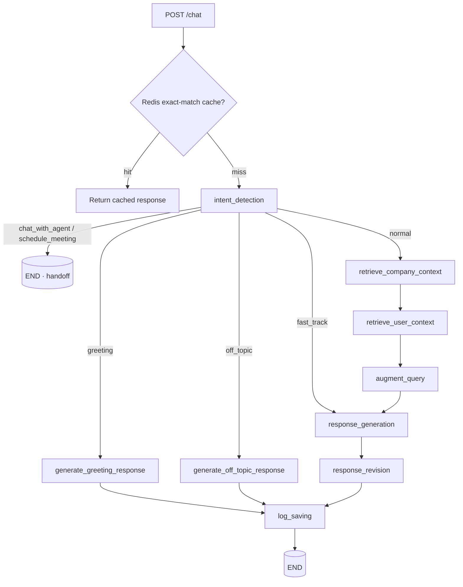

# WB Digital Solutions — AI Chatbot (LangGraph)

> Production AI assistant powering the [WB Digital Solutions](https://www.wbdigitalsolutions.com) website — a stateful **LangGraph** agent with RAG over a company knowledge base, conversation memory, multi-layer caching, and full **Langfuse** observability. Built to ship, not to demo.

[](https://github.com/wbrunovieira/chatbotWBDigitalSolutionsLangGraph/actions/workflows/ci.yml)
[](https://github.com/wbrunovieira/chatbotWBDigitalSolutionsLangGraph/actions/workflows/deploy.yml)


---

## Why it's interesting

This is a real, in-production conversational agent — not a tutorial wrapper around a single LLM call. It's built as an explicit **state graph** so each step (intent detection, retrieval, generation, self-revision, logging) is observable, routable, and independently testable. It runs **without PyTorch** (ONNX embeddings via FastEmbed), so the container is small and cheap to host, and every LLM hop is traced and scored in Langfuse with versioned prompts.

## Architecture

A request flows through a compiled **LangGraph** `StateGraph`. The entry node classifies the user's intent, then a conditional router decides the path: greetings and off-topic messages short-circuit to a cheap canned-style response, direct service questions take a **fast track** that skips retrieval, and everything else runs the full RAG pipeline before generating, self-revising, and logging the answer.



### Graph nodes

| Node | Responsibility |
|------|----------------|
| `intent_detection` | Classifies the message (greeting / off-topic / direct question / agent handoff / schedule) via DeepSeek; sets `fast_track`. |
| `retrieve_company_context` | RAG: embeds the query and searches the Qdrant `company_info` collection for relevant company knowledge. |
| `retrieve_user_context` | Pulls prior conversation turns from the Qdrant `chat_logs` collection (long-term memory). |
| `augment_query` | Fuses the user query with retrieved company + user context into a grounded prompt. |
| `response_generation` | Generates the answer with DeepSeek using the Langfuse-versioned prompt. |
| `response_revision` | Self-review pass that refines tone/accuracy before the answer is returned. |
| `log_saving` | Persists the exchange (embedded) back into Qdrant for future memory. |

## Tech stack

- **Orchestration:** LangGraph `StateGraph` (LangChain 0.3) with conditional routing + fast-track paths.
- **API:** FastAPI + Uvicorn behind an nginx reverse proxy, strict CORS allowlist, `/health` + `/chat` endpoints.
- **Abuse & cost controls:** per-IP rate limiting + a daily spend circuit-breaker (both Redis-backed), request-size caps, and an admin-token-gated `/usage-report`. See [Security](#security--abuse-controls).
- **LLM:** DeepSeek (`deepseek-chat`) over the OpenAI-compatible REST API.
- **Embeddings:** FastEmbed (ONNX `all-MiniLM-L6-v2`) — **no PyTorch**, keeping the image lightweight.
- **Vector DB / RAG + memory:** Qdrant (`company_info` knowledge base + `chat_logs` conversation history).
- **Caching:** Redis exact-match cache (7-day TTL, keyed by `sha256(message + language + page)`) to skip the graph entirely on repeats.
- **Observability:** Langfuse — full request traces, response scoring/evaluation, and **versioned prompts** (`v1` → `v3`) so prompt changes are tracked in production.
- **Cost control:** a custom `DeepSeekOptimizer` that estimates tokens, applies optimization headers, tracks usage, and skips API calls when a call isn't worth making.
- **Deploy:** Docker (`python:3.11-slim`) + Ansible (nginx reverse proxy, Let's Encrypt SSL, `docker-compose`).

## API

### `GET /health`
```json
{ "status": "healthy" }
```

### `POST /chat`
```jsonc
// request
{
  "message": "Vocês fazem aplicações com IA?",
  "user_id": "anon",
  "language": "pt-BR",
  "current_page": "/services",
  "page_url": "https://wbdigitalsolutions.com/services"
}
```
The response carries the assistant's answer plus cache metadata (`cached`, `cache_type`) when served from Redis. Full request/response shapes live in [`docs/api/endpoints.md`](docs/api/endpoints.md).

## MCP server — the agent's tools, callable by any MCP client

The same tools the in-app agent uses — `create_lead`, `schedule_meeting`,
`handoff_to_human` — are also exposed as a standards-compliant **MCP** (Model Context
Protocol) server ([`mcp_server.py`](mcp_server.py)), so any MCP client (Claude Desktop,
Cursor, the MCP Inspector) can list and call them. **One tool implementation
(`tools.py`), two consumers** (the LangGraph agent and MCP) — both go through the same
Pydantic validation, timeout + retry, and per-IP lead cap.

```bash
pip install mcp
python mcp_server.py          # stdio transport
```

Connect from **Claude Desktop** (`claude_desktop_config.json`):

```json
{
  "mcpServers": {
    "wb-digital-solutions": {
      "command": "python",
      "args": ["/absolute/path/to/mcp_server.py"]
    }
  }
}
```

Then ask *"create a lead for Padaria do Zé"* and Claude calls the CRM through the server.
Inspect it with `npx @modelcontextprotocol/inspector python mcp_server.py`.

## Running locally

```bash
# 1. Install (no PyTorch — fast)
pip install -r requirements.txt

# 2. Configure environment (see below)
cp ansible/templates/env.j2 .env   # then fill in the values

# 3. Run
uvicorn main:app --host 0.0.0.0 --port 8000
```

Or with Docker:

```bash
docker build -t wb-chatbot .
docker run -p 8000:8000 --env-file .env wb-chatbot
```

### Environment variables

| Variable | Purpose |
|----------|---------|
| `DEEPSEEK_API_KEY` | DeepSeek LLM API key |
| `QDRANT_HOST` / `QDRANT_API_KEY` | Qdrant vector database |
| `REDIS_HOST` / `REDIS_PORT` / `REDIS_DB` | Redis cache (defaults: `localhost` / `6379` / `0`) |
| `LANGFUSE_PUBLIC_KEY` / `LANGFUSE_SECRET_KEY` / `LANGFUSE_HOST` | Langfuse observability |

## Security & abuse controls

The chatbot is called straight from the browser, so it's designed assuming the
endpoint is public and hostile. Controls, from outer to inner:

- **Rate limiting** — per-IP fixed-window limits (per minute and per hour), backed
  by Redis so they hold across workers and restarts.
- **Spend circuit-breaker** — a hard daily USD cap (global + per-IP) on DeepSeek
  spend. Once crossed, `/chat` returns `503` *before* calling the LLM, so abuse can
  never turn into an invoice. A one-per-day alert fires at 70% of the cap.
- **Request-size caps** — `message` is length-limited at the app and body size is
  capped at nginx (64k), defusing the token-amplification vector (one `/chat` call
  fans out into up to 3 LLM calls).
- **Strict CORS** — a fixed origin allowlist owned solely by the app (nginx adds no
  CORS of its own); no credentials, only the verbs the widget uses.
- **Locked-down infra** — Qdrant and Redis are on the internal Docker network only
  (never published), the app binds to loopback behind nginx, secrets are generated
  on the host and kept `0600`, and UFW default-denies inbound as defense in depth.
- **Reduced surface** — interactive docs (`/docs`, `/redoc`, `/openapi.json`) are
  disabled in production, and `/usage-report` sits behind an admin bearer token.

## Tests & CI/CD

- **Tests** — a `pytest` suite ([`tests/`](tests/)) covers the `/chat` frontend
  contract, rate limiting, the spend cap, per-request cost accounting, and the
  hardening above. Everything runs against `fakeredis` with the LLM/vector layer
  stubbed — no network, no keys, no spend.
- **CI** ([`.github/workflows/ci.yml`](.github/workflows/ci.yml)) — runs the suite
  on every push and PR to `main`.
- **CD** ([`.github/workflows/deploy.yml`](.github/workflows/deploy.yml)) — on green
  CI, runs the Ansible playbook against the VPS, gated by a manual-approval
  `production` environment with the VPS host key pinned. Setup lives in
  [`deploy/ci/README.md`](deploy/ci/README.md).

## Deployment

Infrastructure is codified under [`ansible/`](ansible/): playbooks provision an nginx reverse proxy with Let's Encrypt SSL and run the app via `docker-compose` on the target host. See [`ansible/README.md`](ansible/README.md) and [`ansible/deploy.sh`](ansible/deploy.sh).

## Repository layout

```
main.py              FastAPI app + request lifecycle (limits → cache → graph → trace)
graph_config.py      LangGraph StateGraph wiring + conditional routing
nodes.py             Graph nodes: intent, retrieval, generation, revision, logging
security.py          Per-IP rate limiting + daily spend circuit-breaker (Redis)
deepseek_optimizer.py  Token/usage optimization, per-request cost accounting
langfuse_*.py        Langfuse client, tracing, scoring, versioned prompts (v1–v3)
cache.py / cached_responses.py  Redis caching + pattern cache
config.py            Environment configuration
tests/               pytest suite (contract, rate limit, spend cap, hardening)
.github/workflows/   CI (pytest) + CD (Ansible deploy with approval gate)
experiments/         Offline evaluation harness + datasets
ansible/             IaC: nginx, SSL, docker-compose deploy, UFW
docs/                API, deployment and optimization documentation
```

## Engineering highlights

- **Graph-structured, not prompt-spaghetti** — routing and fast-tracking are explicit edges, so behavior is inspectable and each node is unit-tested (`experiments/`).
- **RAG + persistent memory** — company knowledge and past conversations are both vector-retrieved, so answers are grounded and context-aware across sessions.
- **Production observability** — every turn is traced and scored in Langfuse, and prompts are versioned there rather than hard-coded.
- **Cost-aware by design** — Redis short-circuiting + the DeepSeek optimizer cut redundant LLM spend, and a daily spend circuit-breaker caps worst-case cost under abuse.
- **Hardened for a public endpoint** — per-IP rate limiting, request-size caps, strict CORS, and locked-down infra (Qdrant/Redis off the public internet, docs disabled in prod).
- **Tested & continuously deployed** — a mocked `pytest` suite gates every push via CI, and CD ships to production through a manual-approval Ansible pipeline.
- **Lightweight & reproducible** — ONNX embeddings (no PyTorch) and a slim Docker image, deployed via Ansible IaC.

---

Built by [Walter Bruno Vieira](https://www.linkedin.com/in/walter-bruno-vieira) · [github.com/wbrunovieira](https://github.com/wbrunovieira)
