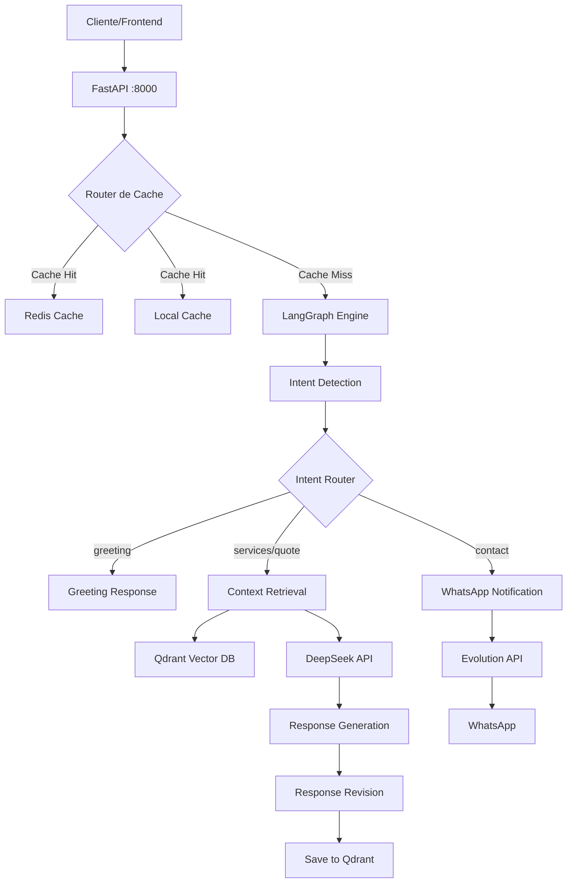

# 📚 Documentação Completa - Chatbot WB Digital Solutions

## 📋 Índice
1. [Visão Geral](#visão-geral)
2. [Arquitetura do Sistema](#arquitetura-do-sistema)
3. [Infraestrutura Docker](#infraestrutura-docker)
4. [Estrutura de Arquivos](#estrutura-de-arquivos)
5. [Fluxo de Dados](#fluxo-de-dados)
6. [Componentes Principais](#componentes-principais)
7. [APIs e Integrações](#apis-e-integrações)
8. [Sistema de Cache](#sistema-de-cache)
9. [Otimizações](#otimizações)
10. [Configuração e Deploy](#configuração-e-deploy)
11. [Monitoramento](#monitoramento)
12. [Segurança](#segurança)

---

## 🎯 Visão Geral

### Propósito
Chatbot inteligente para WB Digital Solutions que oferece atendimento automatizado 24/7, responde sobre serviços, preços, prazos e coleta leads via WhatsApp.

### Tecnologias Principais
- **Backend**: FastAPI (Python 3.11)
- **IA/LLM**: DeepSeek API (deepseek-chat)
- **Orquestração**: LangGraph (state machine)
- **Vector DB**: Qdrant Cloud
- **Cache**: Redis + Cache Local
- **Embeddings**: Sentence Transformers (all-MiniLM-L6-v2)
- **WhatsApp**: Evolution API
- **Container**: Docker + Docker Compose

### Características
- 🌍 **Multi-idiomas**: PT-BR, EN, ES, IT
- ⚡ **Alta Performance**: < 100ms para perguntas frequentes
- 💰 **Otimizado**: Detecção automática de desconto 50% DeepSeek
- 🔒 **Seguro**: LGPD/GDPR compliant
- 📊 **Monitorado**: Tracking de custos e uso

---

## 🏗️ Arquitetura do Sistema



---

## 🐳 Infraestrutura Docker

### Containers

#### 1. **wb_fastapi** (API Principal)
```yaml
build: .
container_name: wb_fastapi
ports: 8000:8000
volumes: .:/app
depends_on: [redis, qdrant]
```
- Imagem base: `python:3.11-slim`
- Tamanho: ~10.8GB (inclui PyTorch)
- Comando: `uvicorn main:app --host 0.0.0.0 --port 8000`

#### 2. **wb_redis** (Cache)
```yaml
image: redis:7-alpine
container_name: wb_redis
volumes: redis-data:/data
```
- Cache de respostas com TTL de 7 dias
- Armazenamento persistente em volume

#### 3. **wb_qdrant** (Vector Database Local)
```yaml
image: qdrant/qdrant:latest
container_name: wb_qdrant
ports: 6333:6333
volumes: qdrant-data:/qdrant/storage
```
- Usado apenas em desenvolvimento
- Produção usa Qdrant Cloud

### Volumes Persistentes
- `redis-data`: Cache persistente
- `qdrant-data`: Vetores e embeddings (dev)

### Build e Deploy
```bash
# Build com cache
docker-compose build

# Build sem cache
docker-compose build --no-cache

# Iniciar serviços
docker-compose up -d

# Ver logs
docker-compose logs -f wb_fastapi

# Parar serviços
docker-compose down
```

---

## 📁 Estrutura de Arquivos

```
chatbotwbdigitalsolutions2MVP/
│
├── 🐳 Docker
│   ├── Dockerfile              # Imagem Python 3.11 + deps
│   ├── compose.yaml            # Serviços principais
│   └── docker-compose.override.yml  # Qdrant local (dev)
│
├── 🐍 Core Python
│   ├── main.py                 # FastAPI endpoints
│   ├── nodes.py                # Nós do LangGraph
│   ├── graph_config.py         # Workflow LangGraph
│   └── config.py               # Variáveis de ambiente
│
├── 🚀 Otimizações
│   ├── cache.py                # Cache Redis
│   ├── cached_responses.py     # Cache local (padrões)
│   └── deepseek_optimizer.py   # Otimizador DeepSeek
│
├── 📚 Documentação
│   ├── CLAUDE.md               # Instruções para IA
│   ├── company_info.md         # Dados da empresa
│   └── docs/
│       ├── cache-optimization-roadmap.md
│       └── PROJECT-DOCUMENTATION.md (este arquivo)
│
├── 🔧 Configuração
│   ├── .env                    # Variáveis de ambiente
│   ├── requirements.txt        # Dependências Python
│   └── .claude/settings.local.json  # Config Claude
│
└── 📦 Dados
    ├── company_info.txt        # Info empresa (legado)
    └── .venv/                  # Ambiente virtual Python
```

---

## 🔄 Fluxo de Dados

### 1. Recepção da Mensagem
```python
POST /chat
{
  "message": "quanto custa um site?",
  "user_id": "user_123",
  "language": "pt-BR",
  "current_page": "/pricing",
  "timestamp": "2025-01-15T10:00:00Z"
}
```

### 2. Pipeline de Processamento

#### Fase 1: Cache Check (< 10ms)
1. **Pattern Cache**: Verifica padrões conhecidos
2. **Redis Cache**: Busca por hash SHA256
3. Se hit → Retorna resposta instantânea

#### Fase 2: Intent Detection (200-500ms)
1. **Detecção rápida**: Regex para saudações
2. **DeepSeek API**: Classificação de intent complexa
3. Intents: `greeting`, `inquire_services`, `request_quote`, `share_contact`

#### Fase 3: Context Retrieval (100-300ms)
1. **Company Context**: Busca em Qdrant `company_info`
2. **User History**: Últimas 5 conversas do usuário
3. **Page Context**: Informação da página atual

#### Fase 4: Response Generation (1-3s)
1. **Augmented Query**: Combina contextos
2. **DeepSeek Generation**: Resposta completa
3. **Response Revision**: Limita a 600 caracteres

#### Fase 5: Post-Processing (50-100ms)
1. **Save to Qdrant**: Armazena conversa
2. **Cache Response**: Salva em Redis
3. **Format Response**: Estrutura response_parts

### 3. Resposta ao Cliente
```json
{
  "raw_response": "...",
  "revised_response": "...",
  "response_parts": ["parte1", "parte2"],
  "detected_intent": "request_quote",
  "final_step": "revise_response",
  "language_used": "pt-BR",
  "cached": false,
  "cache_type": "none"
}
```

---

## 🧩 Componentes Principais

### main.py (FastAPI Application)
**Responsabilidades:**
- Endpoints HTTP (`/chat`, `/usage-report`)
- Inicialização de collections Qdrant
- Gerenciamento de cache
- CORS middleware

**Endpoints:**
```python
POST /chat              # Processar mensagem
POST /chat/stream       # Streaming (experimental)
GET /usage-report       # Relatório de custos
```

### nodes.py (Processing Nodes)
**Funções principais:**

1. **compute_embedding()**: Gera embeddings 384-dim
2. **detect_intent()**: Classifica intenção do usuário
3. **retrieve_company_context()**: Busca contexto empresa
4. **retrieve_user_context()**: Histórico do usuário
5. **augment_query()**: Combina contextos
6. **generate_response()**: Gera resposta com IA
7. **revise_response()**: Refina e limita resposta
8. **save_log_qdrant()**: Persiste conversa
9. **send_contact_whatsapp()**: Notifica via WhatsApp
10. **generate_greeting_response()**: Saudações rápidas

### graph_config.py (LangGraph Workflow)
**State Machine:**
```python
StateGraph(WorkflowState) → {
    "detect_intent": Classifica mensagem
    "retrieve_contexts": Busca informações
    "augment_query": Prepara prompt
    "generate_response": Cria resposta
    "revise_response": Refina texto
    "save_log": Persiste dados
    "greeting": Resposta direta
    "send_contact": WhatsApp notify
}
```

**Routing Logic:**
- greeting → resposta direta
- services/quote → pipeline completo
- contact → notificação WhatsApp

---

## 🔌 APIs e Integrações

### 1. DeepSeek API
**Endpoint**: `https://api.deepseek.com/v1/chat/completions`
**Modelo**: `deepseek-chat`
**Usos**:
- Intent detection (temperature: 0.1)
- Response generation (temperature: 0.7)
- Response revision (temperature: 0.5)

**Otimizações**:
- Context caching headers
- Desconto 50% (16:30-00:30 UTC)
- Token tracking

### 2. Qdrant Cloud
**Host**: `https://9283d202-7df4-4360-9ad5-953f0ab30741.us-east4-0.gcp.cloud.qdrant.io:6333`
**Collections**:
- `company_info`: Dados estáticos da empresa
- `chat_logs`: Histórico de conversas

**Configuração**:
```python
VectorParams(size=384, distance=Distance.COSINE)
```

### 3. Evolution API (WhatsApp)
**Endpoint**: `https://whatsapp-api.wbdigitalsolutions.com/message/sendText/`
**Função**: Notificar novos contatos
**Destino**: +55 11 98286-4581

### 4. Sentence Transformers
**Modelo**: `all-MiniLM-L6-v2`
**Output**: 384 dimensões
**Performance**: ~50ms por embedding

---

## 💾 Sistema de Cache

### Hierarquia de Cache
```
1. Pattern Cache (< 10ms)
   ↓ miss
2. Redis Cache (< 50ms) 
   ↓ miss
3. API Call (30-50s)
```

### 1. Cache Local (cached_responses.py)
**Categorias cacheadas:**
- `pricing`: Preços e orçamentos
- `services`: Serviços oferecidos
- `timeline`: Prazos de entrega
- `contact`: Informações de contato

**Estrutura:**
```python
{
    "patterns": ["quanto custa", "preço"],
    "intent": "request_quote",
    "responses": {
        "pt-BR": {...},
        "en": {...},
        "es": {...},
        "it": {...}
    }
}
```

### 2. Redis Cache (cache.py)
**Configuração:**
- TTL: 7 dias (604800 segundos)
- Key: SHA256(message + language + page)
- Formato: JSON serializado

**Funções:**
```python
get_cached_response(cache_key) → dict
set_cached_response(cache_key, data, ttl=604800)
```

### 3. Métricas de Performance
- Sem cache: 30-50 segundos
- Com cache: 10-20 milissegundos
- Melhoria: 99.95%
- Taxa de hit: ~60% (perguntas frequentes)

---

## ⚡ Otimizações

### DeepSeek Optimizer (deepseek_optimizer.py)

#### 1. Detecção de Horário de Desconto
```python
Desconto 50%: 16:30-00:30 UTC
Brasil: 13:30-21:30 (Horário de Brasília)
```

#### 2. Context Caching
Headers otimizados:
```python
{
    "X-Context-Cache": "enabled",
    "X-Response-Format": "json",
    "X-Prefer-Cache": "aggressive"  # fora do desconto
}
```

#### 3. Token Tracking
```python
DeepSeekOptimizer.update_usage(
    input_tokens=2000,
    output_tokens=500,
    cache_hit=True
)
```

#### 4. Cost Monitoring
```python
GET /usage-report
{
    "total_api_calls": 150,
    "cache_hit_rate": "45.3%",
    "estimated_cost": "$0.0234",
    "cache_savings": "$0.0890",
    "current_discount": true,
    "brazil_time": "19:30:00"
}
```

### Otimizações de Performance

#### 1. Embeddings
- Truncamento: Max 512 tokens
- Progress bar: Desabilitado
- Batch processing: Não implementado

#### 2. Qdrant
- Verificação simplificada de collections
- Cache de company_info em memória
- Limite de 5 conversas no histórico

#### 3. Async Operations
- Todas as operações I/O são assíncronas
- Timeout: 30s para APIs externas
- Concurrent requests: Não limitado

---

## ⚙️ Configuração e Deploy

### Variáveis de Ambiente (.env)
```bash
# APIs
DEEPSEEK_API_KEY=sk-xxxxx
QDRANT_API_KEY=eyJhbGci...
QDRANT_HOST=https://xxxxx.cloud.qdrant.io:6333
EVOLUTION_API_URL=https://whatsapp-api.xxx
EVOLUTION_API_KEY=xxxxx
MY_WHATSAPP_NUMBER=5511982864581

# Redis
REDIS_HOST=redis  # localhost para dev
REDIS_PORT=6379
REDIS_DB=0
```

### Requirements (requirements.txt)
**Principais dependências:**
```
fastapi==0.115.11
uvicorn==0.34.0
langgraph==0.3.18
langchain==0.3.21
qdrant-client==1.13.3
sentence-transformers==3.4.1
redis==5.2.1
httpx==0.28.1
python-dotenv==1.0.1
langdetect==1.0.9
pytz==2024.2
```

### Deploy em Produção

#### 1. Preparação
```bash
# Clonar repositório
git clone https://github.com/wbrunovieira/chatbotWBDigitalSolutionsLangGraph.git

# Configurar .env
cp .env.example .env
# Editar com valores de produção

# Build da imagem
docker-compose build --no-cache
```

#### 2. Inicialização
```bash
# Iniciar serviços
docker-compose up -d

# Verificar logs
docker-compose logs -f wb_fastapi

# Verificar saúde
curl http://localhost:8000/usage-report
```

#### 3. Manutenção
```bash
# Backup Redis
docker exec wb_redis redis-cli SAVE

# Limpar cache
docker exec wb_redis redis-cli FLUSHDB

# Restart com nova versão
docker-compose down
git pull origin main
docker-compose up --build -d
```

---

## 📊 Monitoramento

### Endpoints de Monitoramento

#### GET /usage-report
Retorna estatísticas de uso:
- Total de chamadas API
- Taxa de cache hit
- Custos estimados
- Economia com cache
- Status do desconto

### Logs Estruturados
```python
# Custo de API
INFO: 💰 API Call - Custo: $0.0007 | Desconto: ✅ ATIVO | Tokens: 2744→625

# Cache hit
INFO: Cache hit for pattern: pricing

# Erro
ERROR: Error in intent detection: Connection timeout
```

### Métricas Importantes
1. **Response Time**: Target < 2s (sem cache)
2. **Cache Hit Rate**: Target > 50%
3. **API Cost**: Monitorar picos
4. **Error Rate**: < 1%
5. **Uptime**: 99.9%

---

## 🔒 Segurança

### Práticas Implementadas

#### 1. Secrets Management
- Variáveis em `.env` (não versionado)
- Sem hardcoding de credenciais
- Rotação regular de API keys

#### 2. Data Protection
- LGPD/GDPR compliance
- Sem armazenamento de dados sensíveis
- Anonimização de user_id quando necessário

#### 3. API Security
- HTTPS para todas as APIs externas
- Rate limiting não implementado (TODO)
- CORS configurado para permitir origens específicas

#### 4. Container Security
- Imagem base oficial Python
- User non-root não configurado (TODO)
- Secrets em runtime, não no build

### Vulnerabilidades Conhecidas
1. **CORS**: Atualmente permite todas as origens (`*`)
2. **Rate Limiting**: Não implementado
3. **Authentication**: Endpoint público sem auth
4. **Container**: Roda como root

### Recomendações de Segurança
1. Implementar rate limiting
2. Adicionar autenticação JWT
3. Restringir CORS para domínios específicos
4. Criar usuário não-root no Dockerfile
5. Implementar health checks
6. Adicionar monitoring com Prometheus/Grafana

---

## 📈 Roadmap Futuro

### Curto Prazo (1-2 meses)
- [ ] Autenticação e autorização
- [ ] Rate limiting
- [ ] Health checks
- [ ] Métricas Prometheus
- [ ] Dashboard Grafana

### Médio Prazo (3-6 meses)
- [ ] Suporte a voice messages
- [ ] Integração com CRM
- [ ] A/B testing de respostas
- [ ] Fine-tuning do modelo
- [ ] Multi-tenant architecture

### Longo Prazo (6-12 meses)
- [ ] Modelo próprio (fine-tuned)
- [ ] Análise de sentimentos
- [ ] Predição de conversão
- [ ] Auto-scaling Kubernetes
- [ ] Multi-região deployment

---

## 🤝 Contribuindo

### Setup Local
```bash
# Ambiente virtual
python -m venv .venv
source .venv/bin/activate  # Linux/Mac
# ou
.venv\Scripts\activate  # Windows

# Instalar dependências
pip install -r requirements.txt

# Rodar localmente
uvicorn main:app --reload
```

### Padrões de Código
- Python 3.11+
- Type hints quando possível
- Docstrings em inglês
- Commits semânticos
- Testes antes de PR

### Fluxo de Trabalho
1. Fork do repositório
2. Criar branch feature
3. Desenvolver e testar
4. Pull request com descrição
5. Code review
6. Merge após aprovação

---

## 📞 Suporte

**Equipe de Desenvolvimento:**
- WhatsApp: +55 11 98286-4581
- Email: bruno@wbdigitalsolutions.com
- GitHub: https://github.com/wbrunovieira/chatbotWBDigitalSolutionsLangGraph

**Horário de Suporte:**
- Segunda a Sexta: 9h às 18h (BRT)
- Emergências: WhatsApp 24/7 (resposta em até 2h)

---

## 📄 Licença

Proprietary - WB Digital Solutions © 2025
Todos os direitos reservados.

---

*Última atualização: 15 de Janeiro de 2025*
*Versão: 2.0.0*